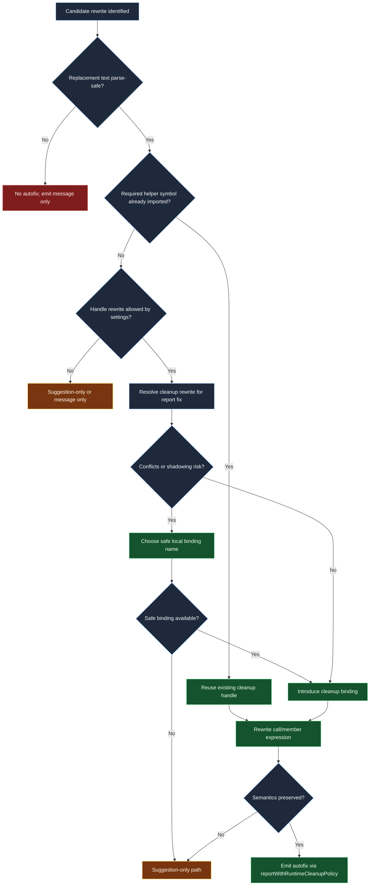

# Autofix safety decision tree

This chart explains how runtime cleanup rules decide whether to emit a fix, a suggestion, or a diagnostic-only report.

## Why this chart matters

- Binding insertion and ownership rewrites are where most autofix regressions happen.
- The tree clarifies that local-name safety and parse safety are independent gates.
- Suggestion fallback is a correctness tool, not a failure mode.

## Review checklist

- Verify cleanup binding insertion honors plugin settings and nearest program scope.
- Verify local binding selection does not shadow existing bindings.
- Verify rewritten output remains parse-safe and semantically equivalent.
